# 📘 Projeto WordPress na AWS - Infraestrutura Escalável

Este projeto tem como objetivo implantar uma arquitetura escalável e de alta disponibilidade para o WordPress utilizando recursos da AWS como VPC, RDS, EFS, EC2 com Auto Scaling e Load Balancer.

---

## Versões do Projeto

### 🔹 **v1.0 - Criação da VPC, dos SGs e do RDS**

**Objetivo**: Criar a base de rede e o banco de dados

**Etapas:**

- Criação da VPC
  Para criar a VPC, acessamos inicialmente a dashboard VPC, pesquisando pela VPC na página inicial da AWS. Ao clicar em VPC, veremos a seguinte página:
  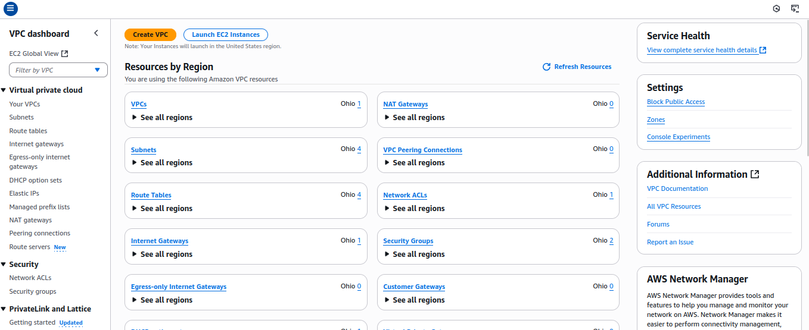
  A partir dela, clicamos em 'Criar VPC'. Na janela de criação, selecione o modo VPC and more, para criação automática da VPC com subnets e routing tables. Escolha o nome desejado e o bloco IPv4 desejado.
  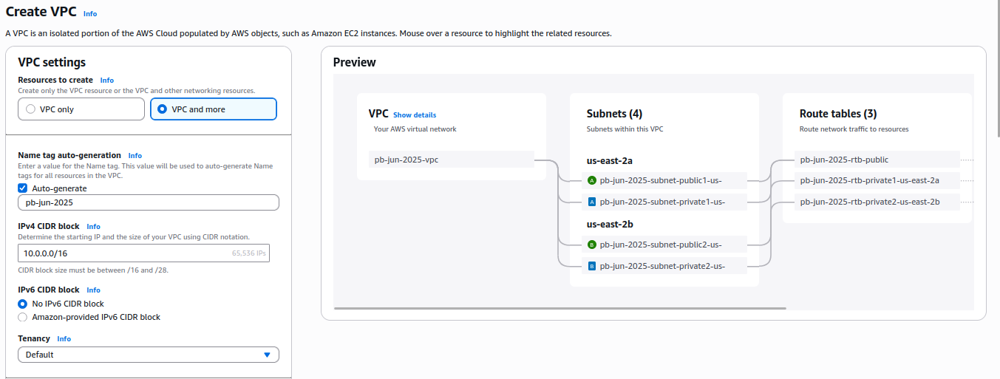
  Em seguida, selecione o número de Availability Zones desejadas para a VPC, assim como o número de redes privadas e públicas em cada uma. Para o projeto em questão, escolhemos 2 AZs, com 2 redes privadas e 2 redes públicas.
  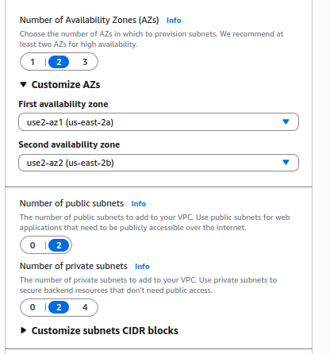
  Por fim, selecione o NAT Gateway, que será criado para que tenhamos acesso público às redes privadas.
  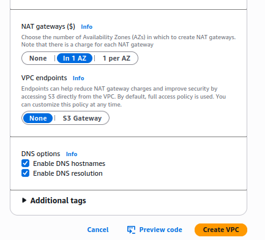

---

- Criação dos SGs
  Para cada serviço que desejamos implementar, criaremos um security group separado, a fim de separar as funcionalidades desejadas a cada um. Entrando em security group, veremos a página de criação de security group. Nessa página, escolhemos um nome, descrição, à qual VPC pertence esse grupo, e definimos suas regras Inbound e Outbound.
  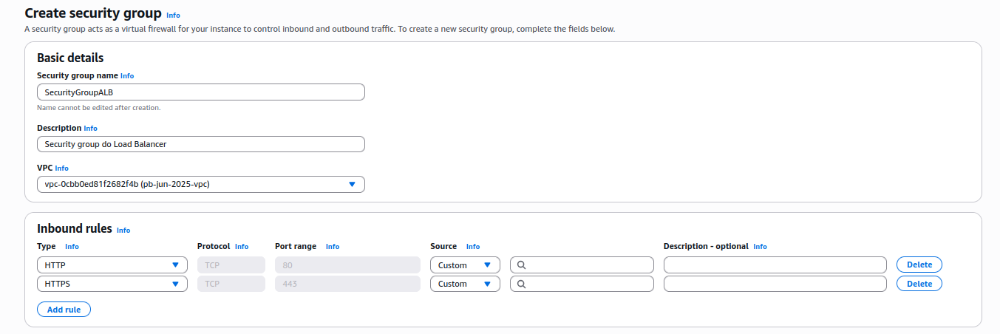
  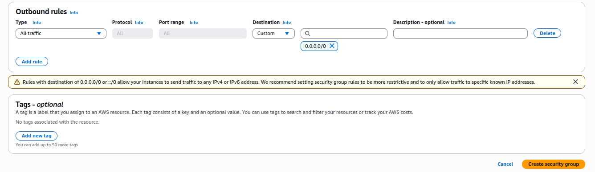
  As regras que definiremos seguirão a seguinte forma:

### Tabela Security Groups

| Security Group | Direção  | Protocolo | Porta | Origem/Destino | Observação                         |
| -------------- | -------- | --------- | ----- | -------------- | ---------------------------------- |
| **ALB**        | Inbound  | TCP       | 80    | 0.0.0.0/0      | HTTP aberto para o público         |
|                | Inbound  | TCP       | 443   | 0.0.0.0/0      | HTTPS aberto para o público        |
|                | Outbound | All       | All   | 0.0.0.0/0      | Necessário para encaminhar tráfego |
| **EC2**        | Inbound  | TCP       | 80    | SG do ALB      | Recebe tráfego HTTP do ALB         |
|                | Inbound  | TCP       | 2049  | SG do EFS      | Comunicação com EFS (NFS)          |
|                | Outbound | TCP       | 3306  | SG do RDS      | Conecta ao banco MySQL/Aurora      |
|                | Outbound | TCP       | 2049  | SG do EFS      | Monta o EFS                        |
|                | Outbound | TCP       | 443   | 0.0.0.0/0      | Acessa serviços externos via HTTPS |
| **RDS**        | Inbound  | TCP       | 3306  | SG da EC2      | Somente EC2 pode acessar o banco   |
|                | Outbound | Nenhuma   | -     | -              | RDS não inicia conexões            |
| **EFS**        | Inbound  | TCP       | 2049  | SG da EC2      | Somente EC2 pode montar o EFS      |
|                | Outbound | Nenhuma   | -     | -              | Não é necessário outbound          |

---

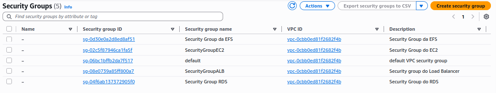

---

- Criação do RDS
  Para criar o RDS, pesquisaremos por "Aurora and RDS" na página inicial da AWS. Nessa página, como podemos ver abaixo, clicaremos em "Create Database"
  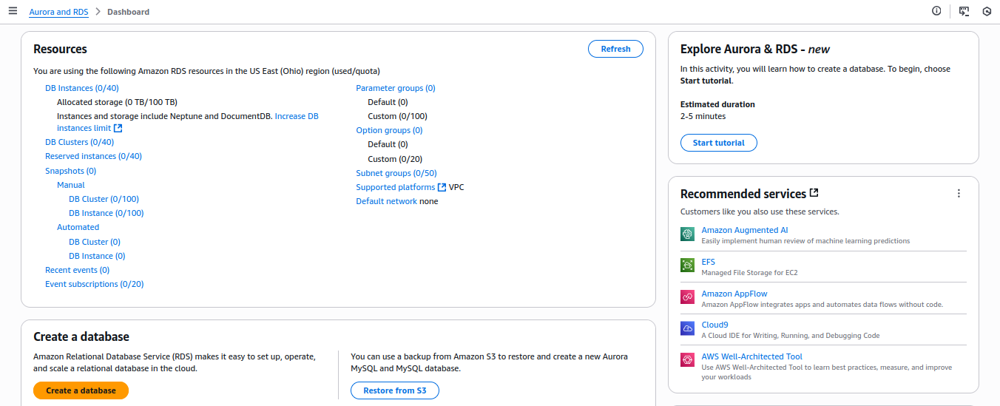
  No início da criação, escolheremos o modo de criação "Standard Create", onde podemos definir mais configurações, e selecionaremos como engine o "MySQL"
  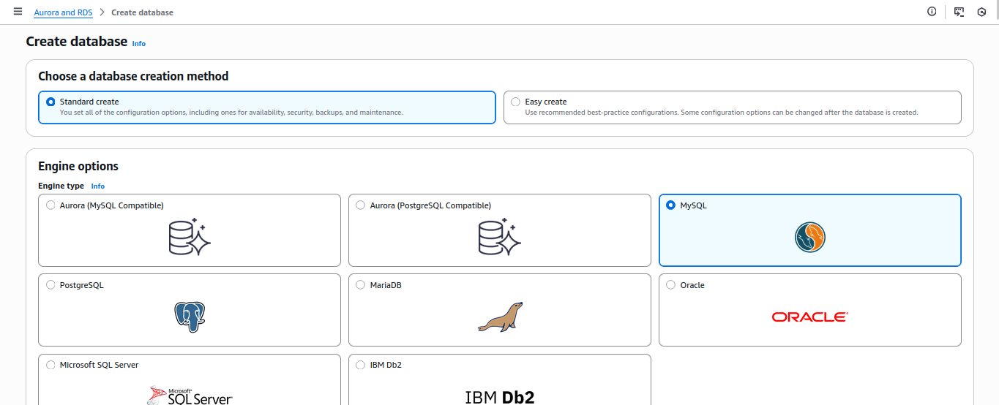
  Em seguida definimos o nome do Banco de Dados, e as informações das credenciais. Essas informações são cruciais para gerenciar a segurança do seu banco de dados, então aja cautelosamente. No projeto em questão, usaremos o Secrets Manager, para evitar a exposição dos segredos no script do user-data.
  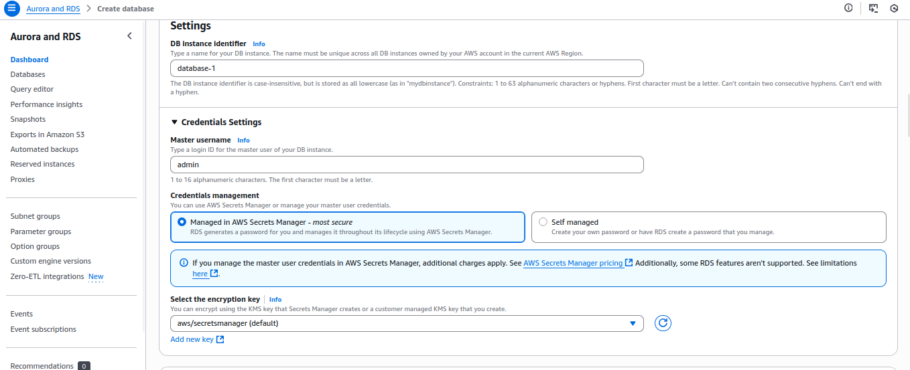
  Em templates, selecionamos "Free Tier" e em Availability, selecionamos "Single-AZ"
  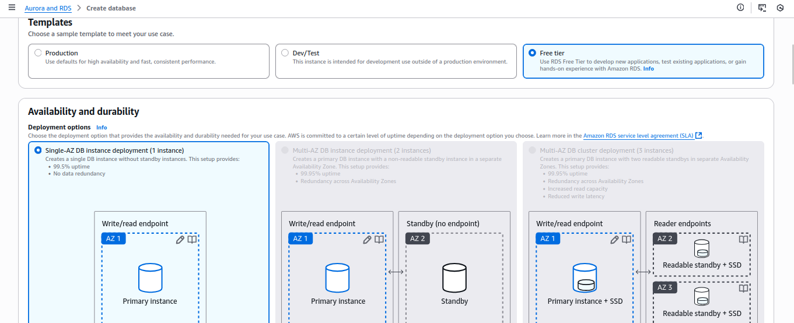
  Em configuração da instância, selecionaremos "db.t3.micro" ao invés do padrão "db.t4g.micro"
  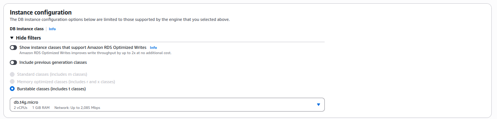
  Em conectividade, selecionamos para conectar com a instância, e escolhemos uma instância com a qual o banco se conectará. Caso ainda não tenha criado, pule essa parte usando o "Don't connect to an EC2 Compute Resource"
  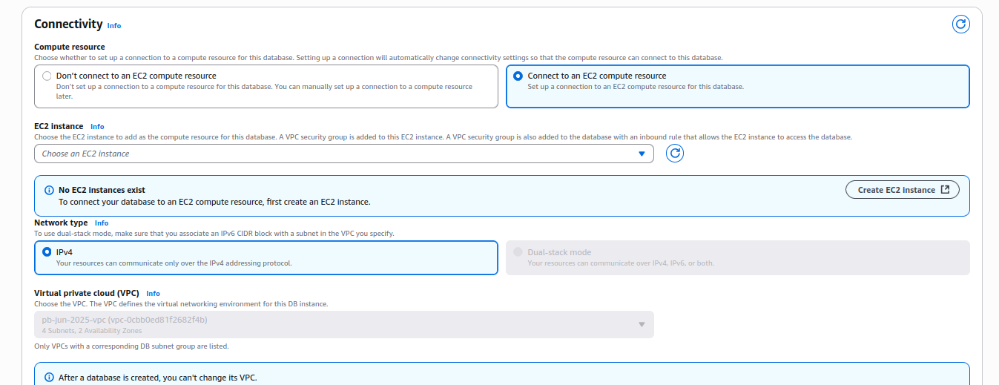
  Deixe aqui a configuração de subnet padrão e selecione "Choose Existing" para o SG. Utilizamos aqui o SG criado na etapa anterior.
  
  Em seguida, selecione a Availability Zone do banco e o certificado.
  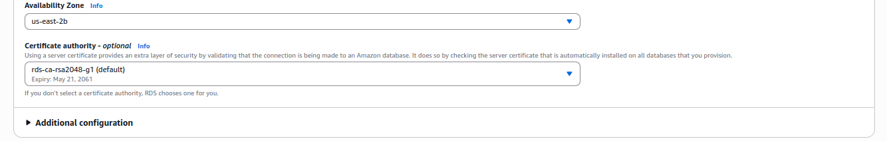
  Por fim, selecionar as configurações de Monitoramento. Aqui podemos selecionar alguns logs que serão enviados para o CloudWatch.
  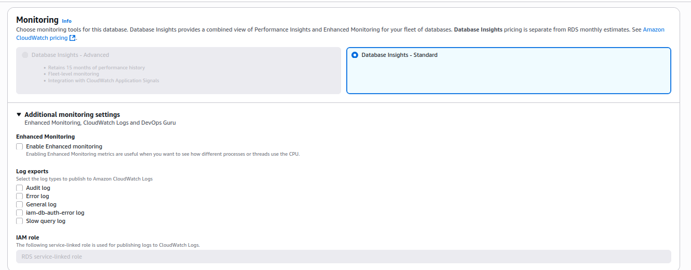

---

## Recursos utilizados

| Serviço AWS     | Uso                            |
| --------------- | ------------------------------ |
| VPC             | Rede personalizada             |
| EC2             | Instâncias para WordPress      |
| RDS             | Banco de dados relacional      |
| EFS             | Armazenamento compartilhado    |
| ALB             | Load balancer de aplicação     |
| ASG             | Escalabilidade automática      |
| Secrets Manager | Armazenamento seguro de senhas |

---
