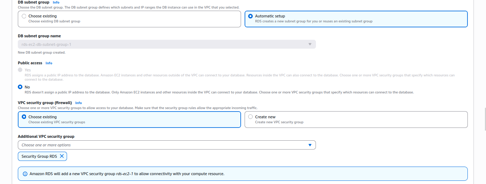

# 📘 Projeto WordPress na AWS - Infraestrutura Escalável

Este projeto tem como objetivo implantar uma arquitetura escalável e de alta disponibilidade para o WordPress utilizando recursos da AWS como VPC, RDS, EFS, EC2 com Auto Scaling e Load Balancer.

---

## Versões do Projeto

### 🔹 **v1.0 - Criação da VPC, dos SGs e do RDS**

**Objetivo**: Criar a base de rede e o banco de dados

**Etapas:**

- Criação da VPC
  Para criar a VPC, acessamos inicialmente a dashboard VPC, pesquisando pela VPC na página inicial da AWS. Ao clicar em VPC, veremos a seguinte página:
  
  A partir dela, clicamos em 'Criar VPC'. Na janela de criação, selecione o modo VPC and more, para criação automática da VPC com subnets e routing tables. Escolha o nome desejado e o bloco IPv4 desejado.
  
  Em seguida, selecione o número de Availability Zones desejadas para a VPC, assim como o número de redes privadas e públicas em cada uma. Para o projeto em questão, escolhemos 2 AZs, com 2 redes privadas e 2 redes públicas.
  
  Por fim, selecione o NAT Gateway, que será criado para que tenhamos acesso público às redes privadas.
  

---

- Criação dos SGs
  Para cada serviço que desejamos implementar, criaremos um security group separado, a fim de separar as funcionalidades desejadas a cada um. Entrando em security group, veremos a página de criação de security group. Nessa página, escolhemos um nome, descrição, à qual VPC pertence esse grupo, e definimos suas regras Inbound e Outbound.
  
  
  As regras que definiremos seguirão a seguinte forma:

### Tabela Security Groups

| Security Group | Direção  | Protocolo | Porta | Origem/Destino | Observação                         |
| -------------- | -------- | --------- | ----- | -------------- | ---------------------------------- |
| **ALB**        | Inbound  | TCP       | 80    | 0.0.0.0/0      | HTTP aberto para o público         |
|                | Inbound  | TCP       | 443   | 0.0.0.0/0      | HTTPS aberto para o público        |
|                | Outbound | All       | All   | 0.0.0.0/0      | Necessário para encaminhar tráfego |
| **EC2**        | Inbound  | TCP       | 80    | SG do ALB      | Recebe tráfego HTTP do ALB         |
|                | Inbound  | TCP       | 2049  | SG do EFS      | Comunicação com EFS (NFS)          |
|                | Outbound | TCP       | 3306  | SG do RDS      | Conecta ao banco MySQL/Aurora      |
|                | Outbound | TCP       | 2049  | SG do EFS      | Monta o EFS                        |
|                | Outbound | TCP       | 443   | 0.0.0.0/0      | Acessa serviços externos via HTTPS |
| **RDS**        | Inbound  | TCP       | 3306  | SG da EC2      | Somente EC2 pode acessar o banco   |
|                | Outbound | Nenhuma   | -     | -              | RDS não inicia conexões            |
| **EFS**        | Inbound  | TCP       | 2049  | SG da EC2      | Somente EC2 pode montar o EFS      |
|                | Outbound | Nenhuma   | -     | -              | Não é necessário outbound          |

---

---

- Criação do RDS
  Para criar o RDS, pesquisaremos por "Aurora and RDS" na página inicial da AWS. Nessa página, como podemos ver abaixo, clicaremos em "Create Database"
  
  No início da criação, escolheremos o modo de criação "Standard Create", onde podemos definir mais configurações, e selecionaremos como engine o "MySQL"
  
  Em seguida definimos o nome do Banco de Dados, e as informações das credenciais. Essas informações são cruciais para gerenciar a segurança do seu banco de dados, então aja cautelosamente. No projeto em questão, usaremos o Secrets Manager, para evitar a exposição dos segredos no script do user-data.
  
  Em templates, selecionamos "Free Tier" e em Availability, selecionamos "Single-AZ"
  
  Em configuração da instância, selecionaremos "db.t3.micro" ao invés do padrão "db.t4g.micro"
  
  Em conectividade, selecionamos para conectar com a instância, e escolhemos uma instância com a qual o banco se conectará. Caso ainda não tenha criado, pule essa parte usando o "Don't connect to an EC2 Compute Resource"
  
  Deixe aqui a configuração de subnet padrão e selecione "Choose Existing" para o SG. Utilizamos aqui o SG criado na etapa anterior.
  
  Em seguida, selecione a Availability Zone do banco e o certificado.
  
  Por fim, selecionar as configurações de Monitoramento. Aqui podemos selecionar alguns logs que serão enviados para o CloudWatch.
  

---

### 🔹 **v1.1 - Configuração do EFS**
**Objetivo**: Criar o sistema de arquivos compartilhado entre instâncias
**Etapas:**
- Criar EFS
Para criar o EFS, pesquisaremos por EFS e selecionaremos "Create". Nessa janela, selecionamos nome, tipo, e AZ.

Em seguida, em configurações de performance, selecionamos Bursting, pois não necessitamos, para o projeto da performance balanceada do modo "Enhanced".

Em "Lifecycle Management" podemos também retirar as opções de transição para outros tipos de armazenamento, para fins de projeto. Observamos que essas opções são muito interessantes para a preservação dos dados.

- Montar o EFS em `/var/www/html`
Ao script user-data, foi adicionadas as linhas abaixo, para montar o EFS na instância quando ela for criada.
`mount -t efs ${EFS_ID}:/ /var/www/html`
`echo "${EFS_ID}:/ /var/www/html efs defaults,_netdev 0 0" >> /etc/fstab`

---
### 🔹 **v1.2 - Deploy do WordPress com Docker e EFS**
**Objetivo**: Rodar o WordPress via Docker com volume montado no EFS

**Etapas:**
- Criar Launch Template com `user-data`
Pesquisamos na página inicial AWS por Launch Template, e em seguida selecionamos "Create Template". Na página inicial, selecionamos um nome e uma descrição da versão do Template. 

Em seguida selecionamos a imagem base desse template, que no caso foi uma imagem Ubuntu.

O próximo são as tags, que podem ou não ser necessárias a depender do uso do seu projeto.

Em seguida selecionamos o par de chaves para autenticação SSH.

Em Network Settings, podemos selecionar um grupo existente, selecionando o grupo que criamos na versão 1.0. Selecionamos também a AZ onde desejamos colocar a instância. 

Podemos permitir o monitoramento CloudWatch ou não, a depender do projeto.

Ao fim inserimos o script do user-data.

**Descrição do user-data**
- Primeiramente realizamos as instalações necessárias e inicializamos o docker. O sudo é utilizado para que os comandos docker funcionem.
~~~
#!/bin/bash
sudo su

# Dependencias
yum update -y
yum install -y docker git amazon-efs-utils jq aws-cli

systemctl start docker
systemctl enable docker
~~~
- Aqui instalamos o Docker Compose
~~~
# Instalar Docker Compose
curl -L "https://github.com/docker/compose/releases/latest/download/docker-compose-$(uname -s)-$(uname -m)" -o /usr/local/bin/docker-compose
chmod +x /usr/local/bin/docker-compose
ln -s /usr/local/bin/docker-compose /usr/bin/docker-compose
~~~
- Aqui realizamos a montagem da EFS, utilizando seu ID
~~~
# Montar EFS 
export EFS_ID=fs-xxxxxxxx
mkdir -p /var/www/html
mount -t efs ${EFS_ID}:/ /var/www/html
echo "${EFS_ID}:/ /var/www/html efs defaults,_netdev 0 0" >> /etc/fstab
~~~
- Agora buscaremos os segredos no Secrets Manager, para utilizarmos na inicialização do Banco de Dados.
~~~
#Buscar secrets
SECRET_NAME=xxxx
REGION=us-east-2

SECRET_JSON=$(aws secretsmanager get-secret-value \
  --secret-id $SECRET_NAME \
  --region $REGION \
  --query SecretString \
  --output text)

export DB_NAME=$(echo $SECRET_JSON | jq -r .DB_NAME)
export DB_USER=$(echo $SECRET_JSON | jq -r .DB_USER)
export DB_PASSWORD=$(echo $SECRET_JSON | jq -r .DB_PASSWORD)
export DB_HOST=$(echo $SECRET_JSON | jq -r .DB_HOST)
~~~
- Criamos aqui o docker-compose selecionando os serviços desejados, e ao fim inicializamos.
~~~
# Arquivos docker
mkdir -p /opt/wordpress-docker
cd /opt/wordpress-docker

cat > docker-compose.yml <<EOF
version: '3.1'

services:
  wordpress:
    image: wordpress
    restart: always
    ports:
      - "80:80"
    environment:
      WORDPRESS_DB_HOST: ${DB_HOST}
      WORDPRESS_DB_USER: ${DB_USER}
      WORDPRESS_DB_PASSWORD: ${DB_PASSWORD}
      WORDPRESS_DB_NAME: ${DB_NAME}
    volumes:
      - /var/www/html:/var/www/html
EOF

# Iniciar container
docker-compose up -d
~~~

---

### 🔹 **v1.3 - Criação do Auto Scaling Group (ASG) e Configuração do Application Load Balancer (ALB)**
**Objetivo**: Garantir alta disponibilidade com escalabilidade automática e distribuir o tráfego entre instâncias

**Etapas:**
- Na página inicial da AWS, buscamos por Auto Scaling Groups. Na página inicial, clicamos em "Create Auto Scaling Group". Em seguida, escolhemos nome e o "Launch Template" criado anteriormente como base. Selecione a versão correta de seu Launch Template.

- Selecionamos em seguida as opções de Rede, selecionando VPC, AZs, e Balanced Only. 

- Na opção seguinte, podemos selecionar um Load Balancer já criado ou criar um para esse grupo. Selecionando "Attach to a new load balancer", temos a tela de criação do ALB.

- Aqui, selecionar "Application Load Balancer", um nome, se é externo ou interno, VPC, AZ e redes.

- Ao fim, caso seja necessário, configure um listener em uma porta para acesso.

- Voltando ao ASG, temos as configurações de Health Checks

- E, para concluir, selecione o tamanho do grupo - sua capacidade desejada. Em "Scaling", selecione os limites inferior e superior da sua capacidade.

---
## Recursos utilizados

| Serviço AWS     | Uso                            |
| --------------- | ------------------------------ |
| VPC             | Rede personalizada             |
| EC2             | Instâncias para WordPress      |
| RDS             | Banco de dados relacional      |
| EFS             | Armazenamento compartilhado    |
| ALB             | Load balancer de aplicação     |
| ASG             | Escalabilidade automática      |
| Secrets Manager | Armazenamento seguro de senhas |

---
